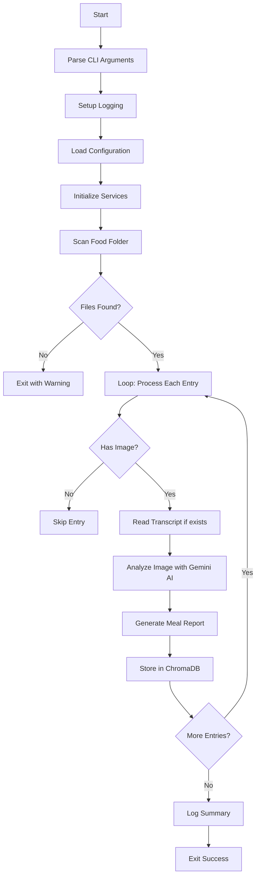

# Process Files Script Documentation

> **For Team Members** - Complete guide to the food image processing pipeline

## Overview

`process_files.py` is the main entry point for processing food images and storing AI-generated summaries in ChromaDB. It scans a folder for food images, analyzes them using Google's Gemini AI, and stores the results in a vector database for future analysis.

---

## Quick Start

```bash
# Basic usage
python process_files.py

# With options
python process_files.py --person "John" --verbose
```

---

## Command Line Arguments

| Argument | Short | Description | Default |
|----------|-------|-------------|---------|
| `--person` | | Name of the person eating | From config (`Eugene`) |
| `--verbose` | `-v` | Enable debug logging | `False` |
| `--help` | `-h` | Show help message | |

---

## Execution Flow



---

## Code Walkthrough

### 1. Imports and Setup (Lines 1-25)

```python
#!/usr/bin/env python3
```
Shebang line allows running script directly: `./process_files.py`

```python
sys.path.insert(0, str(Path(__file__).parent))
```
Adds project root to Python path so imports work correctly.

**Key Imports:**
| Import | Purpose |
|--------|---------|
| `ChatGoogleGenerativeAI` | Gemini AI for image analysis |
| `get_settings` | Load configuration from `.env` |
| `FileService` | Scan files in food folder |
| `FoodProcessor` | Analyze images and generate reports |
| `VectorStoreService` | Store/retrieve from ChromaDB |

---

### 2. Argument Parsing (Lines 28-44)

```python
def parse_args() -> argparse.Namespace:
```

Creates CLI interface with:
- `--person NAME` - Override default person
- `--verbose` / `-v` - Enable debug output

---

### 3. Main Function (Lines 47-132)

#### Step 1: Setup Logging
```python
log_level = logging.DEBUG if args.verbose else logging.INFO
setup_logging(level=log_level)
```
- Normal mode: Shows INFO messages only
- Verbose mode: Shows all DEBUG messages

#### Step 2: Load Configuration
```python
settings = get_settings()
configure_langchain(settings)
```
Loads from `.env` file:
- `GEMINI_API_KEY`
- `LANGCHAIN_API_KEY`
- Folder paths, model names, etc.

#### Step 3: Initialize Services
```python
llm = ChatGoogleGenerativeAI(model=settings.llm_image_model, ...)
file_service = FileService(settings.food_folder_path)
food_processor = FoodProcessor(llm)
vectorstore = VectorStoreService(...)
```

| Service | Responsibility |
|---------|----------------|
| `llm` | AI model for image analysis |
| `file_service` | Find image/transcript files |
| `food_processor` | Generate meal reports |
| `vectorstore` | Store in ChromaDB |

#### Step 4: Scan for Files
```python
entries = file_service.scan_food_files()
```
Looks for files matching:
- `img_YYYYMMDDHHMMSS.jpg` - Food images
- `tr_YYYYMMDDHHMMSS.txt` - Optional voice transcripts

#### Step 5: Process Each Entry
```python
for identifier, file_entry in entries.items():
    if not file_entry.has_image:
        continue
    
    notes = file_service.read_transcript(file_entry.transcript_path)
    
    food_entry = food_processor.process_food_entry(
        identifier=identifier,
        image_path=file_entry.image_path,
        notes=notes,
        person=person
    )
    
    vectorstore.add_entry(food_entry)
```

**Processing Steps:**
1. Skip entries without images
2. Read transcript if available
3. Analyze image with Gemini AI
4. Generate comprehensive meal report
5. Store in ChromaDB with metadata

#### Step 6: Error Handling
```python
except NutritionBalanceError as e:
    logger.error(f"Processing error: {e}")
    return 1
except Exception as e:
    logger.exception(f"Unexpected error: {e}")
    return 1
```
- Known errors: Log and exit with code 1
- Unknown errors: Log full traceback and exit with code 1
- Success: Return 0

---

### 4. Entry Point (Lines 135-136)

```python
if __name__ == "__main__":
    sys.exit(main())
```
Only runs `main()` when script is executed directly (not imported).

---

## Data Flow

```
┌─────────────────┐     ┌─────────────────┐     ┌─────────────────┐
│  Food Folder    │ ──▶ │  FileService    │ ──▶ │ FoodFileEntry   │
│  img_*.jpg      │     │  scan_files()   │     │ {id, img, tr}   │
│  tr_*.txt       │     └─────────────────┘     └────────┬────────┘
└─────────────────┘                                      │
                                                         ▼
┌─────────────────┐     ┌─────────────────┐     ┌─────────────────┐
│  ChromaDB       │ ◀── │ VectorStore     │ ◀── │  FoodProcessor  │
│  (Persistent)   │     │  add_entry()    │     │  process()      │
└─────────────────┘     └─────────────────┘     └────────┬────────┘
                                                         │
                                                         ▼
                                                ┌─────────────────┐
                                                │  Gemini AI      │
                                                │  analyze image  │
                                                └─────────────────┘
```

---

## Stored Metadata

Each entry in ChromaDB contains:

| Field | Example | Description |
|-------|---------|-------------|
| `timestamp` | `20260201174535` | Original identifier |
| `date` | `2026-02-01` | Formatted date |
| `meal_type` | `dinner` | breakfast/lunch/dinner |
| `person` | `Eugene` | Who ate the food |
| `image_path` | `/path/to/img.jpg` | Original image location |

---

## Dependencies

```
config.py                 # Settings management
exceptions.py             # Custom exceptions
services/
  ├── file_service.py     # File operations
  ├── food_processor.py   # AI processing
  └── vectorstore_service.py  # ChromaDB operations
models/
  └── food_entry.py       # Data models
utils/
  └── logging_config.py   # Logging setup
```

---

## Environment Variables

Required in `.env`:
```bash
GEMINI_API_KEY=your_api_key_here
LANGCHAIN_API_KEY=your_langchain_key  # Optional
```

---

## Exit Codes

| Code | Meaning |
|------|---------|
| `0` | Success |
| `1` | Error occurred |
